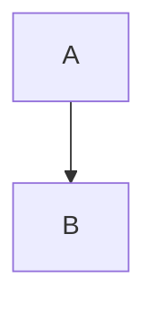

NRF24L01 VCC  ………………………………………… 3.3V of ESP32
NRF24L01 CSN  ………………………………………… D5 of ESP32
NRF24L01 MOSI ………………………………………… D23 of ESP32
NRF24L01 GND  ………………………………………… GND of ESP32
NRF24L01 CE   ………………………………………… D4 of ESP32
NRF24L01 SCK  ………………………………………… D18 of ESP32
NRF24L01 MISO ………………………………………… D19 of ESP32
